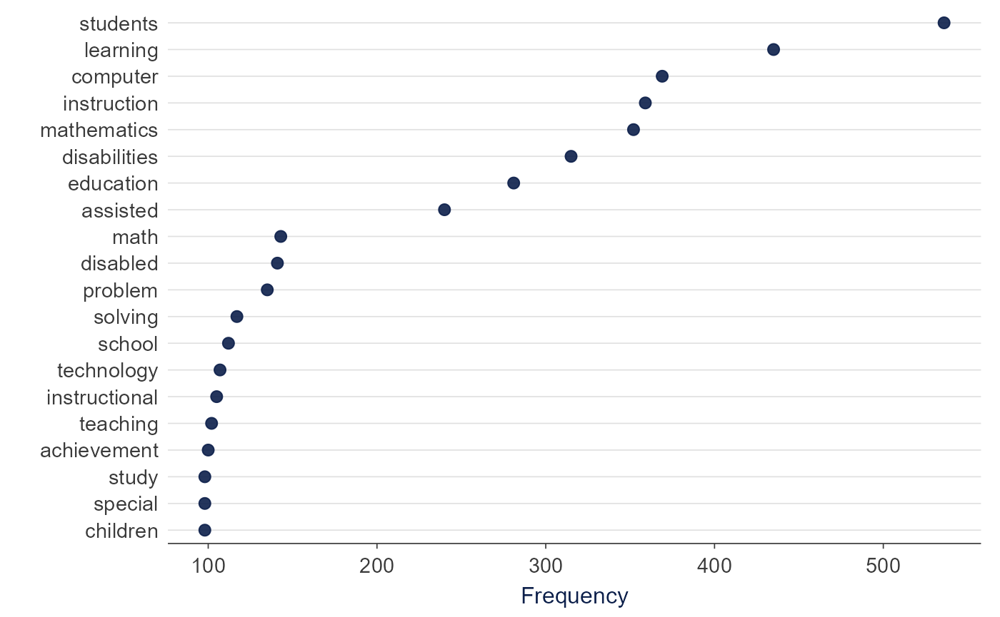
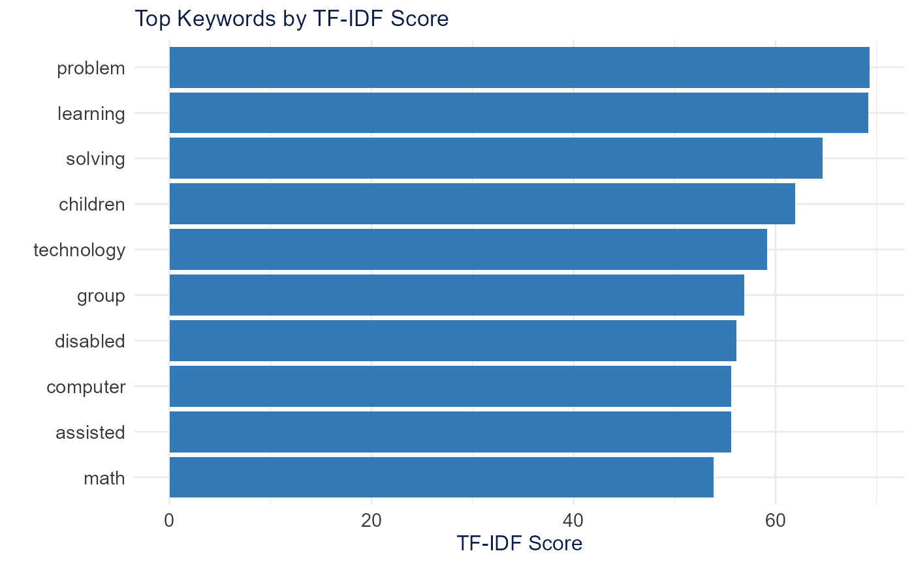
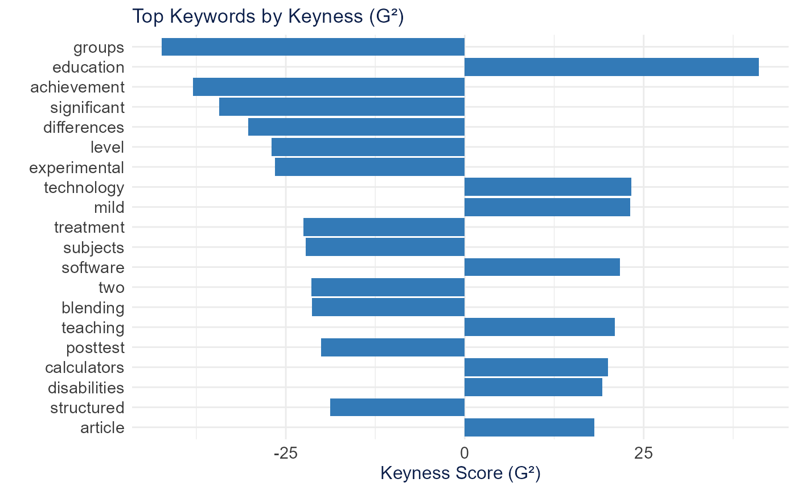
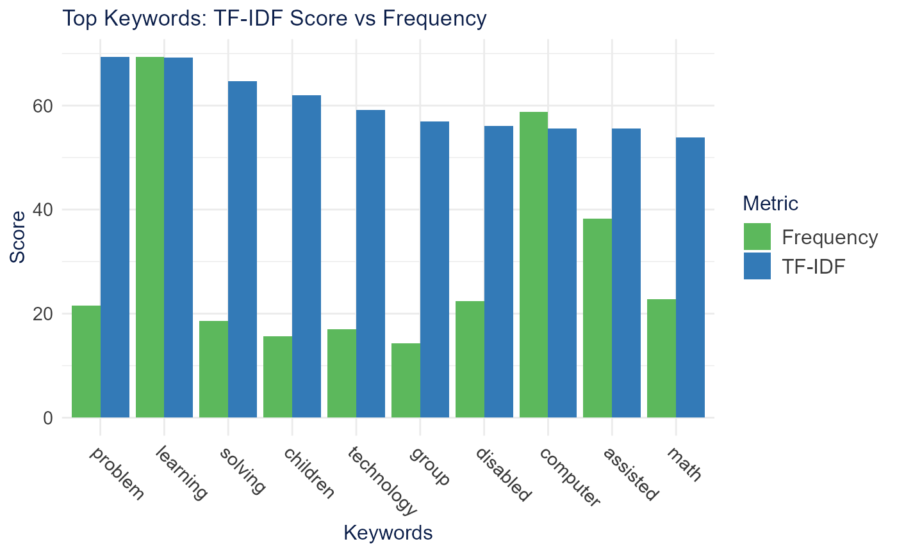
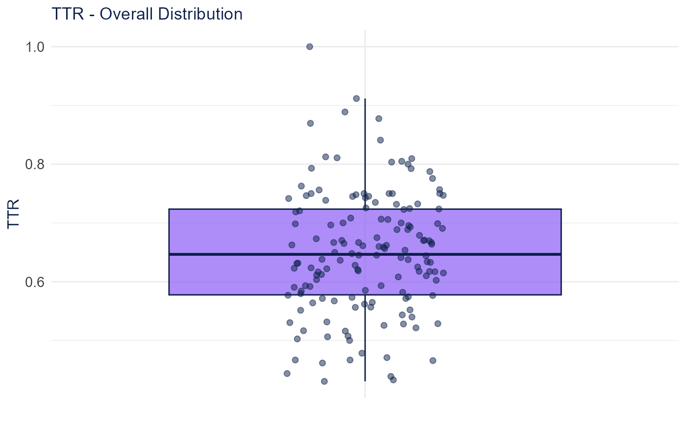
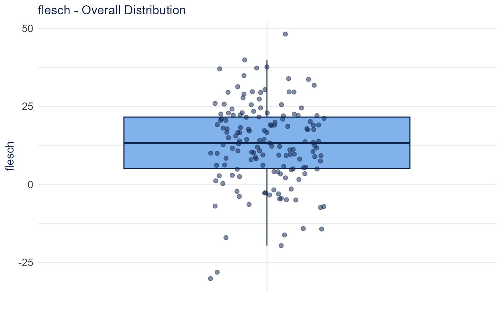
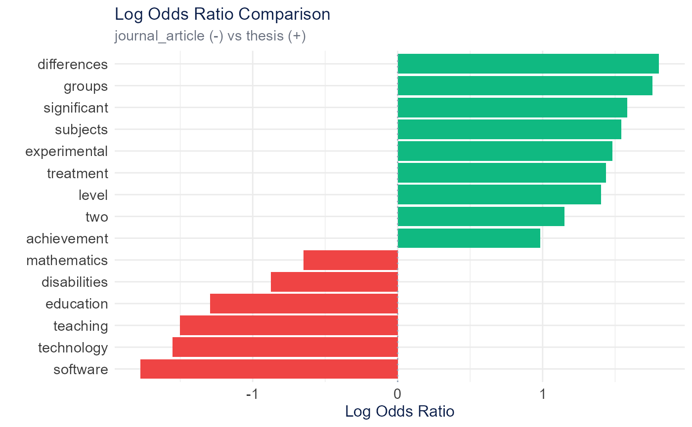
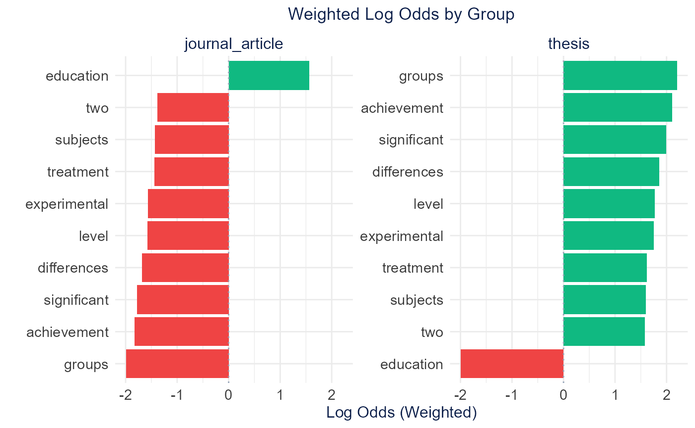
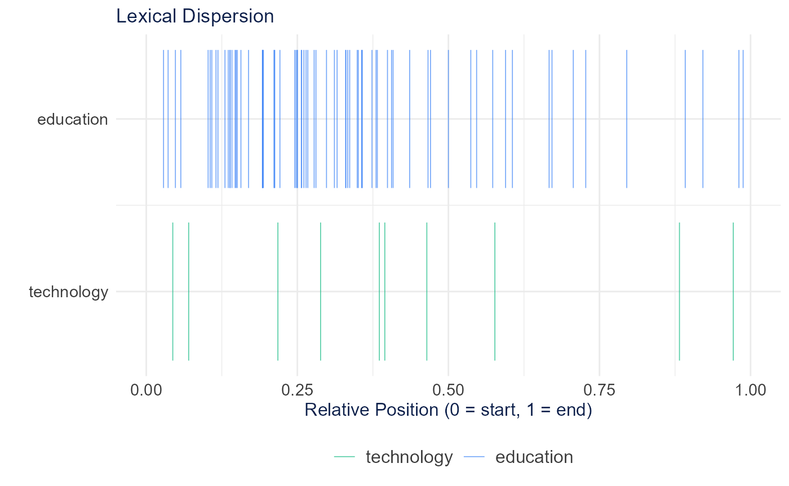

# Lexical Analysis

Lexical analysis examines word patterns, distinctiveness, and
complexity. The sections below follow the Shiny app’s **Lexical
Analysis** tabs in order.

## Setup

A 150-document subset of `SpecialEduTech` keeps the build fast; the full
dataset works the same way.

``` r

library(TextAnalysisR)

mydata <- SpecialEduTech[1:150, ]
united_tbl <- unite_cols(mydata, listed_vars = c("title", "keyword", "abstract"))
tokens <- prep_texts(united_tbl, text_field = "united_texts", remove_stopwords = TRUE)
dfm_object <- quanteda::dfm(tokens)
```

## Linguistic Annotation

Token-level annotation (lemmas, part-of-speech, morphology,
dependencies, named entities) uses spaCy through reticulate, so the
examples below require Python and are not run here.

### Part-of-Speech Tags

[`extract_pos_tags()`](https://mshin77.github.io/TextAnalysisR/reference/extract_pos_tags.md)
returns one row per token with `doc_id, token, lemma, pos, tag`.
Universal POS tags include NOUN, VERB, ADJ, ADV (content words), PROPN
(proper nouns), and DET, ADP, PRON (function words).

``` r

pos <- extract_pos_tags(united_tbl$united_texts)
```

### Morphological Features

[`extract_morphology()`](https://mshin77.github.io/TextAnalysisR/reference/extract_morphology.md)
extracts grammatical features such as Number (Sing/Plur), Tense
(Past/Pres/Fut), VerbForm, Person, and Case.

``` r

morphology <- extract_morphology(united_tbl$united_texts)
```

### Named Entity Recognition

[`extract_named_entities()`](https://mshin77.github.io/TextAnalysisR/reference/extract_named_entities.md)
tags entities such as PERSON, ORG, GPE/LOC, and DATE/MONEY/PERCENT.

``` r

entities <- extract_named_entities(united_tbl$united_texts)
```

## Frequency Trends

[`plot_word_frequency()`](https://mshin77.github.io/TextAnalysisR/reference/plot_word_frequency.md)
shows the most frequent terms in the document-feature matrix.

``` r

plot_word_frequency(dfm_object, n = 20)
```



## Keywords

### TF-IDF

[`extract_keywords_tfidf()`](https://mshin77.github.io/TextAnalysisR/reference/extract_keywords_tfidf.md)
weights terms that are frequent in a document but rare across the
corpus, surfacing distinctive vocabulary.

``` r

keywords <- extract_keywords_tfidf(dfm_object, top_n = 10)
plot_tfidf_keywords(keywords)
```



### Statistical Keyness

[`extract_keywords_keyness()`](https://mshin77.github.io/TextAnalysisR/reference/extract_keywords_keyness.md)
identifies terms that distinguish one group from the rest using a
log-likelihood (G^2) statistic.

``` r

keyness <- extract_keywords_keyness(
  dfm_object,
  target = quanteda::docvars(dfm_object, "reference_type") == "journal_article"
)
plot_keyness_keywords(keyness)
```



### Comparison

[`plot_keyword_comparison()`](https://mshin77.github.io/TextAnalysisR/reference/plot_keyword_comparison.md)
places TF-IDF scores next to term frequency for the top keywords.

``` r

plot_keyword_comparison(keywords, top_n = 10)
```



## Lexical Diversity

[`lexical_diversity_analysis()`](https://mshin77.github.io/TextAnalysisR/reference/lexical_diversity_analysis.md)
reports vocabulary-richness indices. MTLD, MATTR, and HDD are stable
across text lengths; TTR and CTTR are length-sensitive.

``` r

diversity <- lexical_diversity_analysis(dfm_object)
plot_lexical_diversity_distribution(diversity$lexical_diversity, metric = "TTR")
```



| Metric | Description | Note |
|----|----|----|
| TTR | Types / Tokens | Length-sensitive |
| CTTR | Types / sqrt(2 × Tokens) | Partly length-corrected |
| MATTR | Moving-average TTR | Stable across lengths |
| MTLD | Mean length maintaining TTR | Length-independent |
| HDD | Hypergeometric sampling probability | Length-independent, needs 42+ tokens |
| Maas | Log-based index | Lower = more diverse |

## Readability

[`calculate_text_readability()`](https://mshin77.github.io/TextAnalysisR/reference/calculate_text_readability.md)
computes grade-level and reading-ease indices from sentence and word
structure.

``` r

readability <- calculate_text_readability(united_tbl$united_texts)
plot_readability_distribution(readability, metric = "flesch")
```



| Metric | Basis | Output |
|----|----|----|
| Flesch Reading Ease | Sentence length + syllables | 0-100 (higher = easier) |
| Flesch-Kincaid | Sentence length + syllables | Grade level |
| Gunning Fog | Sentence length + complex words | Years of education |
| SMOG | Polysyllabic words | Years of education |
| ARI | Characters per word | Grade level |
| Coleman-Liau | Letters per 100 words | Grade level |

## Log Odds Ratio

[`calculate_log_odds_ratio()`](https://mshin77.github.io/TextAnalysisR/reference/calculate_log_odds_ratio.md)
compares word odds between categories using a Dirichlet-smoothed
log-odds ratio to find distinctive vocabulary.

``` r

log_odds <- calculate_log_odds_ratio(
  dfm_object,
  group_var = "reference_type",
  comparison_mode = "binary",
  top_n = 15
)
plot_log_odds_ratio(log_odds)
```



[`calculate_weighted_log_odds()`](https://mshin77.github.io/TextAnalysisR/reference/calculate_weighted_log_odds.md)
weights the ratio by a z-score (Monroe et al.), so reliably distinctive
terms rank above rare terms with extreme ratios (uses the tidylo
package).

``` r

weighted_odds <- calculate_weighted_log_odds(
  dfm_object,
  group_var = "reference_type",
  top_n = 15
)
plot_weighted_log_odds(weighted_odds)
```



## Lexical Dispersion

[`calculate_lexical_dispersion()`](https://mshin77.github.io/TextAnalysisR/reference/calculate_lexical_dispersion.md)
shows where selected terms appear across documents (an X-ray plot).

``` r

dispersion <- calculate_lexical_dispersion(tokens[1:50], terms = c("education", "technology"))
plot_lexical_dispersion(dispersion)
```



## Multi-Word Expressions

Multi-word (n-gram) detection belongs to the **Preprocess → Multi-Word
Dictionary** step in the app.
[`detect_multi_words()`](https://mshin77.github.io/TextAnalysisR/reference/detect_multi_words.md)
returns a collocations table to feed
[`quanteda::tokens_compound()`](https://quanteda.io/reference/tokens_compound.html).

``` r

compounds <- detect_multi_words(tokens, min_count = 10)
head(compounds, 10)
```

    ##  [1] "learning disabilities" "assisted instruction"  "computer assisted"    
    ##  [4] "problem solving"       "special education"     "learning disabled"    
    ##  [7] "elementary school"     "students learning"     "school students"      
    ## [10] "high school"
