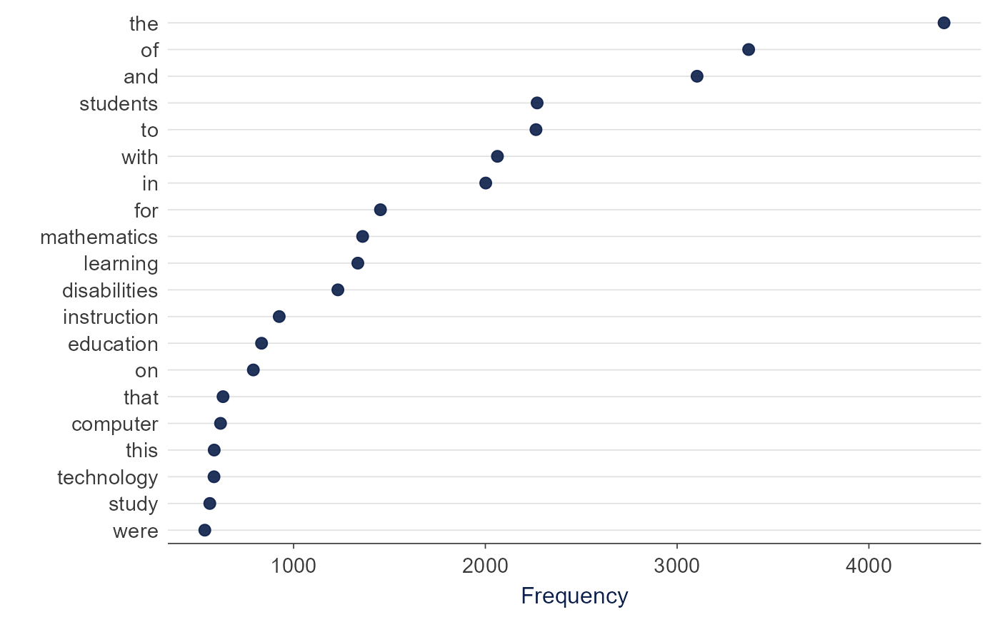

# Getting Started

TextAnalysisR provides text analysis through an interactive Shiny app or
R code.

## Language support

Primary language: English. Preprocessing and STM are language-agnostic
(stopwords for 50+); embeddings and AI features can be multilingual;
spaCy and the sentiment lexicons are English-only.

## Install

``` r

install.packages("TextAnalysisR")
```

## Launch App

``` r

library(TextAnalysisR)
run_app()
```

Or visit [textanalysisr.org](https://www.textanalysisr.org) for the web
version.

## Quick Example

``` r

library(TextAnalysisR)

mydata <- SpecialEduTech
united_tbl <- unite_cols(mydata, listed_vars = c("title", "keyword", "abstract"))

tokens <- prep_texts(united_tbl, text_field = "united_texts")
dfm_object <- quanteda::dfm(tokens)

plot_word_frequency(dfm_object, n = 20)
```



## Features

| Category       | Analyses                           |
|----------------|------------------------------------|
| Lexical        | Word frequency, keywords, networks |
| Semantic       | Similarity, clustering, sentiment  |
| Topic Modeling | STM and BERTopic                   |
