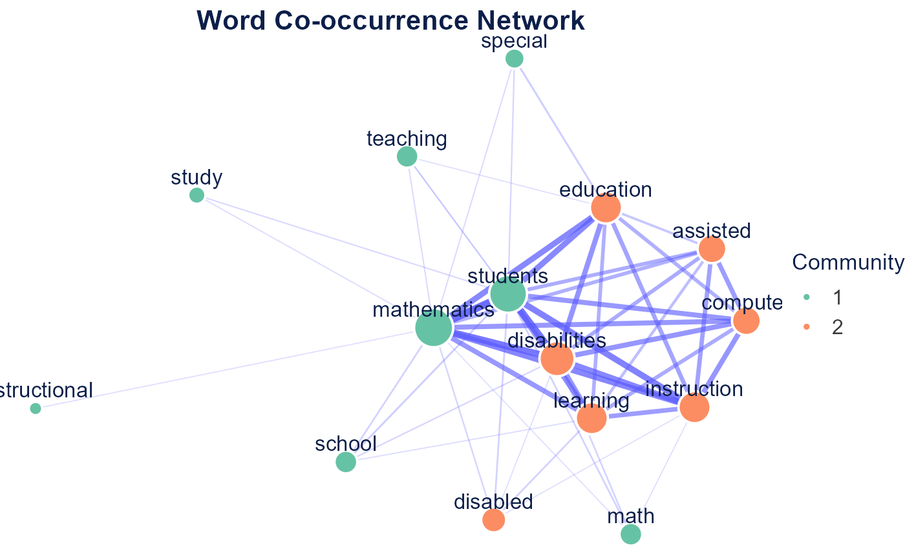
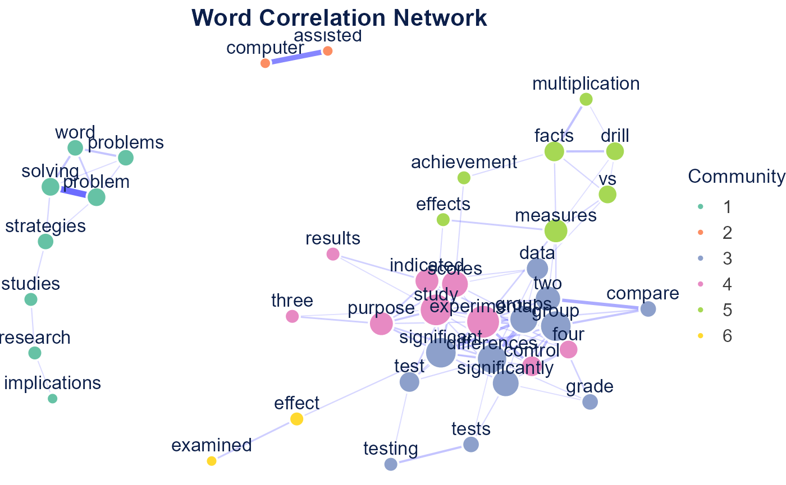
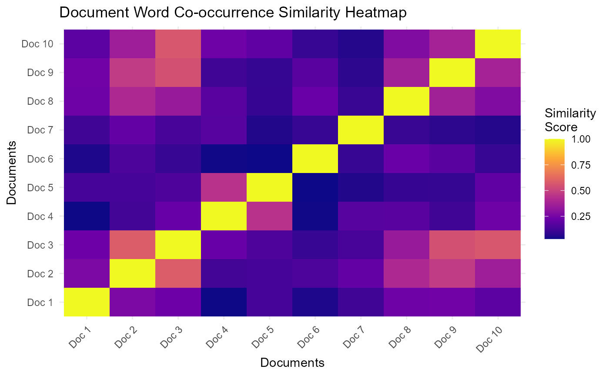
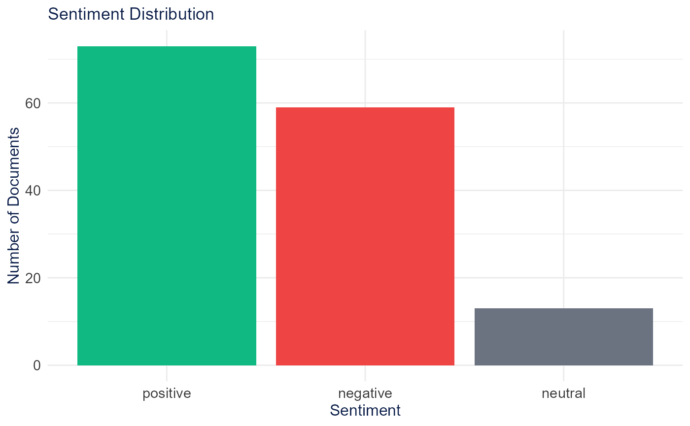
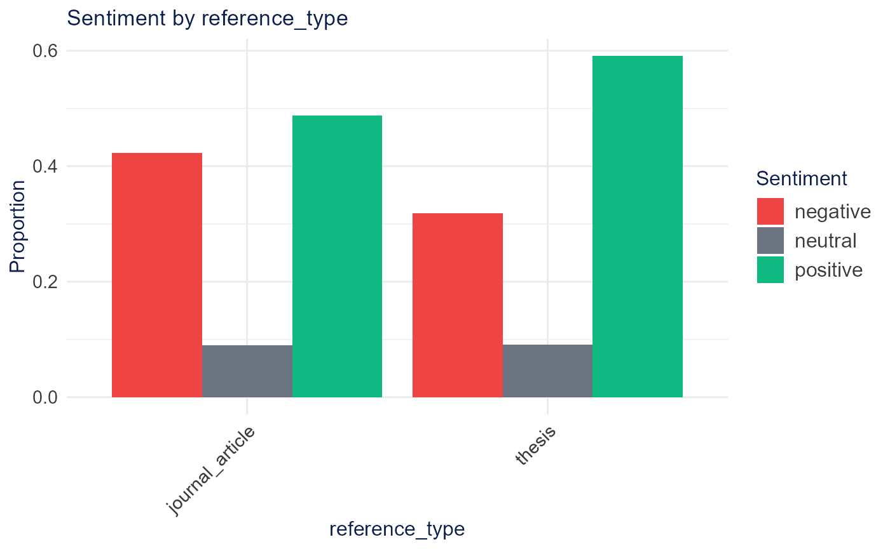

# Semantic Analysis

Semantic analysis examines relationships of meaning between words and
documents. The sections below follow the Shiny app’s **Semantic
Analysis** tabs in order.

## Setup

A 150-document subset of `SpecialEduTech` keeps the build fast; the full
dataset works the same way.

``` r

library(TextAnalysisR)

mydata <- SpecialEduTech[1:150, ]
united_tbl <- unite_cols(mydata, listed_vars = c("title", "keyword", "abstract"))
tokens <- prep_texts(united_tbl, text_field = "united_texts", remove_stopwords = TRUE)
dfm_object <- quanteda::dfm(tokens)
```

## Word Co-occurrence

[`word_co_occurrence_network()`](https://mshin77.github.io/TextAnalysisR/reference/word_co_occurrence_network.md)
builds a network of words that co-occur across documents, with community
detection and centrality metrics. Edges weight by raw counts;
`edge_metric = "pmi"` corrects the bias toward generic frequent words.

``` r

network <- word_co_occurrence_network(
  dfm_object,
  co_occur_n = 50,
  top_node_n = 30,
  node_label_size = 22,
  community_method = "leiden"
)

network$plot
```



``` r

network$table
```

Network Centrality Table

``` r

network$summary
```

Network Summary

## Word Correlation

[`word_correlation_network()`](https://mshin77.github.io/TextAnalysisR/reference/word_correlation_network.md)
connects words by phi correlation of their document co-occurrence
patterns.

``` r

corr_network <- word_correlation_network(
  dfm_object,
  common_term_n = 15,
  corr_n = 0.3,
  community_method = "leiden"
)

corr_network$plot
```



``` r

corr_network$table
```

Network Centrality Table

## Document Similarity

[`semantic_similarity_analysis()`](https://mshin77.github.io/TextAnalysisR/reference/semantic_similarity_analysis.md)
compares documents by words, n-grams, or embeddings (embeddings require
Python). The example below uses word features on a subset and renders a
cosine similarity heatmap.

``` r

subset_texts <- united_tbl$united_texts[1:10]

similarity <- semantic_similarity_analysis(
  subset_texts,
  document_feature_type = "words",
  similarity_method = "cosine",
  verbose = FALSE
)

plot_similarity_heatmap(similarity$similarity_matrix, method_name = "Cosine")
```



| Method     | Description                           | Requires |
|------------|---------------------------------------|----------|
| Words      | Word-frequency vectors (bag-of-words) | none     |
| N-grams    | Word-sequence vectors                 | none     |
| Embeddings | Transformer sentence vectors          | Python   |

## Comparative Analysis

Comparative analysis scores how similar documents in one category are to
a reference category.
[`extract_cross_category_similarities()`](https://mshin77.github.io/TextAnalysisR/reference/extract_cross_category_similarities.md)
pulls cross-category pairs from a similarity matrix and
[`analyze_similarity_gaps()`](https://mshin77.github.io/TextAnalysisR/reference/analyze_similarity_gaps.md)
summarizes the differences. The example uses the first 30 documents.

``` r

term_matrix <- as.matrix(dfm_object)[1:30, ]
normalized <- term_matrix / sqrt(rowSums(term_matrix^2))
sim_matrix <- normalized %*% t(normalized)

docs_data <- data.frame(
  display_name = paste0("doc", 1:30),
  reference_type = quanteda::docvars(dfm_object, "reference_type")[1:30]
)
dimnames(sim_matrix) <- list(docs_data$display_name, docs_data$display_name)

cross <- extract_cross_category_similarities(
  sim_matrix,
  docs_data,
  reference_category = "journal_article",
  category_var = "reference_type",
  id_var = "display_name"
)

gaps <- analyze_similarity_gaps(cross)
gaps$summary_stats
```

    ## # A tibble: 1 × 7
    ##   other_category mean_similarity median_similarity sd_similarity min_similarity
    ##   <fct>                    <dbl>             <dbl>         <dbl>          <dbl>
    ## 1 thesis                   0.268             0.271          0.14          0.025
    ## # ℹ 2 more variables: max_similarity <dbl>, n_pairs <int>

## Semantic Search

[`run_rag_search()`](https://mshin77.github.io/TextAnalysisR/reference/run_rag_search.md)
retrieves the documents most relevant to a query using embedding
similarity. It requires an OpenAI or Gemini API key; see [AI
Integration](https://mshin77.github.io/TextAnalysisR/articles/ai_integration.md).

``` r

results <- run_rag_search(
  query = "math intervention for students with disabilities",
  documents = united_tbl$united_texts,
  provider = "openai"
)
```

## Sentiment & Emotion

[`sentiment_lexicon_analysis()`](https://mshin77.github.io/TextAnalysisR/reference/sentiment_lexicon_analysis.md)
scores documents with the Bing, AFINN, or NRC lexicon. The Bing example
runs below.

``` r

sentiment <- sentiment_lexicon_analysis(dfm_object, lexicon = "bing")
plot_sentiment_distribution(sentiment$document_sentiment)
```



NRC also yields discrete emotions for
[`plot_emotion_radar()`](https://mshin77.github.io/TextAnalysisR/reference/plot_emotion_radar.md).
NRC downloads through `textdata` behind a license-gated prompt, so the
emotion example is shown but not run.

``` r

emotion <- sentiment_lexicon_analysis(dfm_object, lexicon = "nrc")
plot_emotion_radar(emotion$emotion_scores)
```

[`plot_sentiment_by_category()`](https://mshin77.github.io/TextAnalysisR/reference/plot_sentiment_by_category.md)
compares sentiment across a metadata category after joining it to the
scored documents. Transformer
([`sentiment_embedding_analysis()`](https://mshin77.github.io/TextAnalysisR/reference/sentiment_embedding_analysis.md))
and LLM
([`analyze_sentiment_llm()`](https://mshin77.github.io/TextAnalysisR/reference/analyze_sentiment_llm.md))
scoring require Python or an API key and are not run here.

``` r

scored <- sentiment_lexicon_analysis(dfm_object, lexicon = "bing")$document_sentiment
scored$reference_type <- quanteda::docvars(dfm_object, "reference_type")[
  match(scored$document, quanteda::docnames(dfm_object))
]
plot_sentiment_by_category(scored, category_var = "reference_type")
```



## Document Groups

[`cluster_embeddings()`](https://mshin77.github.io/TextAnalysisR/reference/cluster_embeddings.md)
groups documents from a feature matrix. K-means and hierarchical
clustering run in base R; the app’s default UMAP + DBSCAN path requires
Python.
[`generate_cluster_labels_auto()`](https://mshin77.github.io/TextAnalysisR/reference/generate_cluster_labels_auto.md)
labels each group with its most distinctive terms.

``` r

data_matrix <- as.matrix(dfm_object)

groups <- cluster_embeddings(data_matrix, method = "kmeans", n_clusters = 5, verbose = FALSE)
groups$n_clusters
```

    ## [1] 5

``` r

labels <- generate_cluster_labels_auto(data_matrix, groups$clusters, method = "tfidf", n_terms = 3)
labels
```

    ## $`1`
    ## [1] "tutor, reward, arousal"
    ## 
    ## $`2`
    ## [1] "educable, mentally, handicapped"
    ## 
    ## $`3`
    ## [1] "problem, learning, solving"
    ## 
    ## $`4`
    ## [1] "gender, receive, multimedia"
    ## 
    ## $`5`
    ## [1] "educable, basal, classified"

A 2-D map of the groups uses
[`reduce_dimensions()`](https://mshin77.github.io/TextAnalysisR/reference/reduce_dimensions.md)
(PCA runs in base R; t-SNE and UMAP need their packages).

``` r

coords <- reduce_dimensions(data_matrix, method = "PCA", n_components = 2, verbose = FALSE)
head(coords$reduced_data)
```

    ##        
    ## docs           PC1         PC2
    ##   text1 -3.9896707 -2.36735259
    ##   text2  0.8763364 -2.46112657
    ##   text3  1.4292531 -0.70404832
    ##   text4 -5.6720672  0.33713049
    ##   text5 -5.5639779  0.01396902
    ##   text6 -0.6661668  4.07350397
