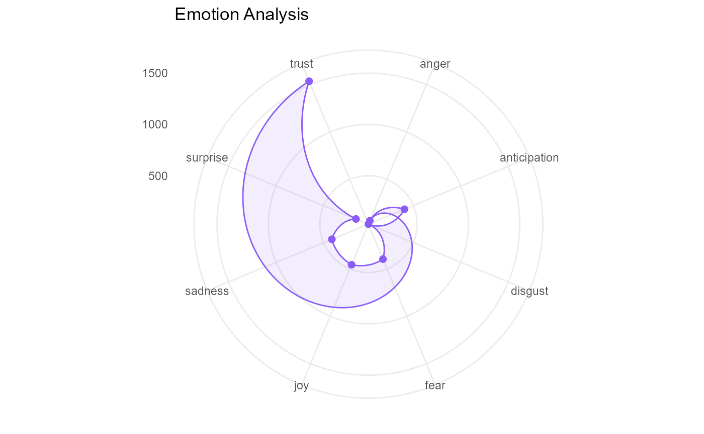

# Semantic Analysis

Semantic analysis examines relationships of meaning between words and
documents. The sections below follow the Shiny app’s **Semantic
Analysis** tabs in order.

## Setup

A 150-document subset of `SpecialEduTech` keeps the build fast; the full
dataset works the same way.

``` r

library(TextAnalysisR)

mydata <- SpecialEduTech[1:150, ]
united_tbl <- unite_cols(mydata, listed_vars = c("title", "keyword", "abstract"))
tokens <- prep_texts(united_tbl, text_field = "united_texts", remove_stopwords = TRUE)
dfm_object <- quanteda::dfm(tokens)
```

## Word Co-occurrence

[`word_co_occurrence_network()`](https://mshin77.github.io/TextAnalysisR/reference/word_co_occurrence_network.md)
builds a network of words that co-occur across documents, with community
detection and centrality metrics.

``` r

network <- word_co_occurrence_network(
  dfm_object,
  co_occur_n = 30,
  top_node_n = 30,
  node_label_size = 22,
  community_method = "leiden"
)

network$plot
```


``` r

network$top_nodes
```

    ##         x      y         label degree betweenness closeness eigenvector
    ## 1  -0.244  0.591      students     58      41.047     0.034       1.000
    ## 2  -0.189  0.405   mathematics     58      41.047     0.034       1.000
    ## 3  -0.041  0.533  disabilities     58      41.047     0.034       1.000
    ## 4  -0.053  0.764   instruction     56      34.631     0.033       0.986
    ## 5  -0.459  0.469     education     54      30.797     0.032       0.965
    ## 6  -0.434  0.837      learning     52      24.181     0.031       0.954
    ## 7  -0.281  0.956      computer     52      24.181     0.031       0.954
    ## 8  -0.843  0.948      assisted     38       7.722     0.026       0.785
    ## 9  -1.247  0.960          math     22       0.222     0.021       0.566
    ## 10 -1.224  1.264        school     20       0.000     0.021       0.537
    ## 11 -1.359  0.668      disabled     20       0.000     0.021       0.537
    ## 12 -0.920  1.452         study     18       0.000     0.020       0.504
    ## 13  0.250  1.347       problem     18       0.125     0.020       0.497
    ## 14 -0.997 -0.130       special     16       0.000     0.020       0.469
    ## 15 -0.653  1.661      teaching     16       0.000     0.020       0.469
    ## 16 -1.019  0.196 instructional     16       0.000     0.020       0.469
    ## 17 -0.646 -0.181        skills     16       0.000     0.020       0.469
    ## 18 -1.290  0.313           use     16       0.000     0.020       0.469
    ## 19  0.663  0.600       solving     16       0.000     0.020       0.452
    ## 20 -0.331  1.695       effects     16       0.000     0.020       0.469
    ## 21 -0.017  1.651    elementary     16       0.000     0.020       0.469
    ## 22  0.871  0.838   achievement     14       0.000     0.020       0.421
    ## 23  0.671  1.161       results     14       0.000     0.020       0.421
    ## 24  0.619  0.118         based     14       0.000     0.020       0.421
    ## 25 -0.263 -0.373      problems     14       0.000     0.020       0.421
    ## 26  0.200 -0.213      research     14       0.000     0.020       0.421
    ## 27  0.619  1.610   performance     12       0.000     0.019       0.362
    ## 28  0.558 -0.516    technology     10       0.000     0.019       0.304
    ## 29 -0.193 -0.936       student      8       0.000     0.019       0.243
    ## 30  1.208  0.063         using      8       0.000     0.019       0.245
    ##    community frequency size_metric_log   size text_size alpha
    ## 1          1       536           4.078 45.000    22.000 1.000
    ## 2          1       352           4.078 45.000    22.000 1.000
    ## 3          1       315           4.078 45.000    22.000 1.000
    ## 4          1       359           4.043 44.321    21.853 0.985
    ## 5          1       281           4.007 43.619    21.701 0.970
    ## 6          1       435           3.970 42.890    21.544 0.954
    ## 7          1       369           3.970 42.890    21.544 0.954
    ## 8          1       240           3.664 36.854    20.239 0.824
    ## 9          1       143           3.135 26.463    17.992 0.599
    ## 10         1       112           3.045 24.673    17.605 0.560
    ## 11         1       141           3.045 24.673    17.605 0.560
    ## 12         1        98           2.944 22.703    17.179 0.518
    ## 13         3       135           2.944 22.703    17.179 0.518
    ## 14         2        98           2.833 20.515    16.706 0.471
    ## 15         1       102           2.833 20.515    16.706 0.471
    ## 16         1       105           2.833 20.515    16.706 0.471
    ## 17         1        98           2.833 20.515    16.706 0.471
    ## 18         1        77           2.833 20.515    16.706 0.471
    ## 19         3       117           2.833 20.515    16.706 0.471
    ## 20         8        69           2.833 20.515    16.706 0.471
    ## 21        10        76           2.833 20.515    16.706 0.471
    ## 22         4       100           2.708 18.052    16.173 0.417
    ## 23         5        63           2.708 18.052    16.173 0.417
    ## 24         6        89           2.708 18.052    16.173 0.417
    ## 25         7        93           2.708 18.052    16.173 0.417
    ## 26        13        73           2.708 18.052    16.173 0.417
    ## 27        11        92           2.565 15.236    15.565 0.356
    ## 28        14       107           2.398 11.949    14.854 0.285
    ## 29         9        69           2.197  8.000    14.000 0.200
    ## 30        12        53           2.197  8.000    14.000 0.200
    ##                                                                                                                                hover_text
    ## 1        Word: students <br>Degree: 58 <br>Betweenness: 41.05 <br>Closeness: 0.03 <br>Eigenvector: 1 <br>Frequency: 536 <br>Community: 1 
    ## 2     Word: mathematics <br>Degree: 58 <br>Betweenness: 41.05 <br>Closeness: 0.03 <br>Eigenvector: 1 <br>Frequency: 352 <br>Community: 1 
    ## 3    Word: disabilities <br>Degree: 58 <br>Betweenness: 41.05 <br>Closeness: 0.03 <br>Eigenvector: 1 <br>Frequency: 315 <br>Community: 1 
    ## 4  Word: instruction <br>Degree: 56 <br>Betweenness: 34.63 <br>Closeness: 0.03 <br>Eigenvector: 0.99 <br>Frequency: 359 <br>Community: 1 
    ## 5     Word: education <br>Degree: 54 <br>Betweenness: 30.8 <br>Closeness: 0.03 <br>Eigenvector: 0.96 <br>Frequency: 281 <br>Community: 1 
    ## 6     Word: learning <br>Degree: 52 <br>Betweenness: 24.18 <br>Closeness: 0.03 <br>Eigenvector: 0.95 <br>Frequency: 435 <br>Community: 1 
    ## 7     Word: computer <br>Degree: 52 <br>Betweenness: 24.18 <br>Closeness: 0.03 <br>Eigenvector: 0.95 <br>Frequency: 369 <br>Community: 1 
    ## 8      Word: assisted <br>Degree: 38 <br>Betweenness: 7.72 <br>Closeness: 0.03 <br>Eigenvector: 0.79 <br>Frequency: 240 <br>Community: 1 
    ## 9          Word: math <br>Degree: 22 <br>Betweenness: 0.22 <br>Closeness: 0.02 <br>Eigenvector: 0.57 <br>Frequency: 143 <br>Community: 1 
    ## 10          Word: school <br>Degree: 20 <br>Betweenness: 0 <br>Closeness: 0.02 <br>Eigenvector: 0.54 <br>Frequency: 112 <br>Community: 1 
    ## 11        Word: disabled <br>Degree: 20 <br>Betweenness: 0 <br>Closeness: 0.02 <br>Eigenvector: 0.54 <br>Frequency: 141 <br>Community: 1 
    ## 12             Word: study <br>Degree: 18 <br>Betweenness: 0 <br>Closeness: 0.02 <br>Eigenvector: 0.5 <br>Frequency: 98 <br>Community: 1 
    ## 13       Word: problem <br>Degree: 18 <br>Betweenness: 0.12 <br>Closeness: 0.02 <br>Eigenvector: 0.5 <br>Frequency: 135 <br>Community: 3 
    ## 14          Word: special <br>Degree: 16 <br>Betweenness: 0 <br>Closeness: 0.02 <br>Eigenvector: 0.47 <br>Frequency: 98 <br>Community: 2 
    ## 15        Word: teaching <br>Degree: 16 <br>Betweenness: 0 <br>Closeness: 0.02 <br>Eigenvector: 0.47 <br>Frequency: 102 <br>Community: 1 
    ## 16   Word: instructional <br>Degree: 16 <br>Betweenness: 0 <br>Closeness: 0.02 <br>Eigenvector: 0.47 <br>Frequency: 105 <br>Community: 1 
    ## 17           Word: skills <br>Degree: 16 <br>Betweenness: 0 <br>Closeness: 0.02 <br>Eigenvector: 0.47 <br>Frequency: 98 <br>Community: 1 
    ## 18              Word: use <br>Degree: 16 <br>Betweenness: 0 <br>Closeness: 0.02 <br>Eigenvector: 0.47 <br>Frequency: 77 <br>Community: 1 
    ## 19         Word: solving <br>Degree: 16 <br>Betweenness: 0 <br>Closeness: 0.02 <br>Eigenvector: 0.45 <br>Frequency: 117 <br>Community: 3 
    ## 20          Word: effects <br>Degree: 16 <br>Betweenness: 0 <br>Closeness: 0.02 <br>Eigenvector: 0.47 <br>Frequency: 69 <br>Community: 8 
    ## 21      Word: elementary <br>Degree: 16 <br>Betweenness: 0 <br>Closeness: 0.02 <br>Eigenvector: 0.47 <br>Frequency: 76 <br>Community: 10 
    ## 22     Word: achievement <br>Degree: 14 <br>Betweenness: 0 <br>Closeness: 0.02 <br>Eigenvector: 0.42 <br>Frequency: 100 <br>Community: 4 
    ## 23          Word: results <br>Degree: 14 <br>Betweenness: 0 <br>Closeness: 0.02 <br>Eigenvector: 0.42 <br>Frequency: 63 <br>Community: 5 
    ## 24            Word: based <br>Degree: 14 <br>Betweenness: 0 <br>Closeness: 0.02 <br>Eigenvector: 0.42 <br>Frequency: 89 <br>Community: 6 
    ## 25         Word: problems <br>Degree: 14 <br>Betweenness: 0 <br>Closeness: 0.02 <br>Eigenvector: 0.42 <br>Frequency: 93 <br>Community: 7 
    ## 26        Word: research <br>Degree: 14 <br>Betweenness: 0 <br>Closeness: 0.02 <br>Eigenvector: 0.42 <br>Frequency: 73 <br>Community: 13 
    ## 27     Word: performance <br>Degree: 12 <br>Betweenness: 0 <br>Closeness: 0.02 <br>Eigenvector: 0.36 <br>Frequency: 92 <br>Community: 11 
    ## 28      Word: technology <br>Degree: 10 <br>Betweenness: 0 <br>Closeness: 0.02 <br>Eigenvector: 0.3 <br>Frequency: 107 <br>Community: 14 
    ## 29           Word: student <br>Degree: 8 <br>Betweenness: 0 <br>Closeness: 0.02 <br>Eigenvector: 0.24 <br>Frequency: 69 <br>Community: 9 
    ## 30            Word: using <br>Degree: 8 <br>Betweenness: 0 <br>Closeness: 0.02 <br>Eigenvector: 0.24 <br>Frequency: 53 <br>Community: 12 
    ##      color
    ## 1  #66C2A5
    ## 2  #66C2A5
    ## 3  #66C2A5
    ## 4  #66C2A5
    ## 5  #66C2A5
    ## 6  #66C2A5
    ## 7  #66C2A5
    ## 8  #66C2A5
    ## 9  #66C2A5
    ## 10 #66C2A5
    ## 11 #66C2A5
    ## 12 #66C2A5
    ## 13 #F38E6A
    ## 14 #B6A580
    ## 15 #66C2A5
    ## 16 #66C2A5
    ## 17 #66C2A5
    ## 18 #66C2A5
    ## 19 #F38E6A
    ## 20 #B4C66D
    ## 21 #F1D834
    ## 22 #B798A2
    ## 23 #9A9CC9
    ## 24 #CB90C5
    ## 25 #D79CA9
    ## 26 #CDBCA2
    ## 27 #F4D055
    ## 28 #B3B3B3
    ## 29 #C1D848
    ## 30 #E6C58C

``` r

network$table
```

Network Centrality Table

``` r

network$summary
```

Network Summary

## Word Correlation

[`word_correlation_network()`](https://mshin77.github.io/TextAnalysisR/reference/word_correlation_network.md)
connects words by phi correlation of their document co-occurrence
patterns.

``` r

corr_network <- word_correlation_network(
  dfm_object,
  common_term_n = 10,
  corr_n = 0.4,
  community_method = "leiden"
)

corr_network$plot
```


``` r

corr_network$top_nodes
```

    ##         x      y        label degree betweenness closeness eigenvector
    ## 1  -2.720  2.827        group     16      31.267     0.053       1.000
    ## 2  -3.025  3.307       groups     10       9.700     0.045       0.742
    ## 3  -3.932  2.189  significant     10      33.917     0.048       0.505
    ## 4  -2.102  3.156 experimental     10       5.017     0.040       0.735
    ## 5  -2.897  4.013          two      8       2.033     0.037       0.579
    ## 6  -2.464  1.991      control      8       5.117     0.038       0.550
    ## 7   1.413 -0.373     retarded      6       0.500     0.333       0.000
    ## 8   1.001  0.194     mentally      6       0.500     0.333       0.000
    ## 9  -1.469  2.816     posttest      6       0.533     0.036       0.496
    ## 10 -1.729  2.109      pretest      6       0.583     0.036       0.462
    ## 11  2.142  3.207        drill      6       5.000     0.200       0.000
    ## 12 -2.173  4.105  differences      6       0.333     0.034       0.464
    ## 13  1.819 -3.088      solving      4       1.000     0.500       0.000
    ## 14  1.794  0.324     educable      4       0.000     0.250       0.000
    ## 15 -1.799 -3.976     assisted      4       1.000     0.500       0.000
    ## 16  2.794  2.510         game      4       3.000     0.167       0.000
    ## 17 -5.232 -1.777   literature      4       2.000     0.250       0.000
    ## 18 -3.614  3.786     compared      4       0.000     0.034       0.357
    ## 19  0.616 -0.518     disorder      4       0.000     0.250       0.000
    ## 20 -3.300  1.359    treatment      4       2.000     0.034       0.238
    ## 21 -4.751  1.263       scores      4       5.500     0.032       0.127
    ## 22 -5.629  1.161     received      4       0.500     0.024       0.057
    ## 23 -5.172  1.944      purpose      4       5.500     0.032       0.127
    ## 24 -4.413 -1.905     findings      4       2.000     0.250       0.000
    ## 25  1.181 -2.650      problem      2       0.000     0.333       0.000
    ## 26  3.566 -1.260        paper      2       0.000     1.000       0.000
    ## 27  3.744 -0.568       pencil      2       0.000     1.000       0.000
    ## 28 -1.966 -4.731     computer      2       0.000     0.333       0.000
    ## 29  1.848  4.053     practice      2       0.000     0.125       0.000
    ## 30  3.308  1.856        games      2       0.000     0.111       0.000
    ## 31 -3.846 -4.184       humans      2       0.000     1.000       0.000
    ## 32 -4.469 -3.853        child      2       0.000     1.000       0.000
    ## 33 -5.963 -1.480       review      2       0.000     0.167       0.000
    ## 34  0.300 -4.881       social      2       0.000     1.000       0.000
    ## 35  0.178 -4.205        areas      2       0.000     1.000       0.000
    ## 36 -1.576 -3.246  instruction      2       0.000     0.333       0.000
    ## 37 -3.609 -1.975 implications      2       0.000     0.167       0.000
    ## 38  1.301  3.147        facts      2       0.000     0.125       0.000
    ## 39  2.547 -3.282         word      2       0.000     0.333       0.000
    ## 40 -1.472 -1.493         post      0       0.000       NaN       0.000
    ##    community frequency size_metric_log   size text_size alpha
    ## 1          6        90           2.833 45.000    22.000 1.000
    ## 2         15        43           2.398 39.315    20.771 0.877
    ## 3         15        41           2.398 39.315    20.771 0.877
    ## 4          6        35           2.398 39.315    20.771 0.877
    ## 5         13        43           2.197 36.694    20.204 0.820
    ## 6          6        43           2.197 36.694    20.204 0.820
    ## 7          2        23           1.946 33.412    19.495 0.749
    ## 8          2        34           1.946 33.412    19.495 0.749
    ## 9          6        22           1.946 33.412    19.495 0.749
    ## 10         6        16           1.946 33.412    19.495 0.749
    ## 11         7        36           1.946 33.412    19.495 0.749
    ## 12        16        29           1.946 33.412    19.495 0.749
    ## 13         1       117           1.609 29.018    18.544 0.654
    ## 14         2        33           1.609 29.018    18.544 0.654
    ## 15         4       240           1.609 29.018    18.544 0.654
    ## 16         7        29           1.609 29.018    18.544 0.654
    ## 17        11        14           1.609 29.018    18.544 0.654
    ## 18        13        23           1.609 29.018    18.544 0.654
    ## 19         2        12           1.609 29.018    18.544 0.654
    ## 20        18        31           1.609 29.018    18.544 0.654
    ## 21        19        29           1.609 29.018    18.544 0.654
    ## 22        19        18           1.609 29.018    18.544 0.654
    ## 23        22        16           1.609 29.018    18.544 0.654
    ## 24        14        19           1.609 29.018    18.544 0.654
    ## 25         1       135           1.099 22.347    17.102 0.510
    ## 26         3        25           1.099 22.347    17.102 0.510
    ## 27         3        19           1.099 22.347    17.102 0.510
    ## 28         5       369           1.099 22.347    17.102 0.510
    ## 29         8        69           1.099 22.347    17.102 0.510
    ## 30         9        30           1.099 22.347    17.102 0.510
    ## 31        10        13           1.099 22.347    17.102 0.510
    ## 32        10        18           1.099 22.347    17.102 0.510
    ## 33        11        24           1.099 22.347    17.102 0.510
    ## 34        12        13           1.099 22.347    17.102 0.510
    ## 35        12        17           1.099 22.347    17.102 0.510
    ## 36         4       359           1.099 22.347    17.102 0.510
    ## 37        14        24           1.099 22.347    17.102 0.510
    ## 38        20        39           1.099 22.347    17.102 0.510
    ## 39        21        42           1.099 22.347    17.102 0.510
    ## 40        17        20           0.000  8.000    14.000 0.200
    ##                                                                                                                               hover_text
    ## 1           Word: group <br>Degree: 16 <br>Betweenness: 31.27 <br>Closeness: 0.05 <br>Eigenvector: 1 <br>Frequency: 90 <br>Community: 6 
    ## 2        Word: groups <br>Degree: 10 <br>Betweenness: 9.7 <br>Closeness: 0.05 <br>Eigenvector: 0.74 <br>Frequency: 43 <br>Community: 15 
    ## 3  Word: significant <br>Degree: 10 <br>Betweenness: 33.92 <br>Closeness: 0.05 <br>Eigenvector: 0.5 <br>Frequency: 41 <br>Community: 15 
    ## 4  Word: experimental <br>Degree: 10 <br>Betweenness: 5.02 <br>Closeness: 0.04 <br>Eigenvector: 0.73 <br>Frequency: 35 <br>Community: 6 
    ## 5           Word: two <br>Degree: 8 <br>Betweenness: 2.03 <br>Closeness: 0.04 <br>Eigenvector: 0.58 <br>Frequency: 43 <br>Community: 13 
    ## 6        Word: control <br>Degree: 8 <br>Betweenness: 5.12 <br>Closeness: 0.04 <br>Eigenvector: 0.55 <br>Frequency: 43 <br>Community: 6 
    ## 7           Word: retarded <br>Degree: 6 <br>Betweenness: 0.5 <br>Closeness: 0.33 <br>Eigenvector: 0 <br>Frequency: 23 <br>Community: 2 
    ## 8           Word: mentally <br>Degree: 6 <br>Betweenness: 0.5 <br>Closeness: 0.33 <br>Eigenvector: 0 <br>Frequency: 34 <br>Community: 2 
    ## 9        Word: posttest <br>Degree: 6 <br>Betweenness: 0.53 <br>Closeness: 0.04 <br>Eigenvector: 0.5 <br>Frequency: 22 <br>Community: 6 
    ## 10       Word: pretest <br>Degree: 6 <br>Betweenness: 0.58 <br>Closeness: 0.04 <br>Eigenvector: 0.46 <br>Frequency: 16 <br>Community: 6 
    ## 11                Word: drill <br>Degree: 6 <br>Betweenness: 5 <br>Closeness: 0.2 <br>Eigenvector: 0 <br>Frequency: 36 <br>Community: 7 
    ## 12  Word: differences <br>Degree: 6 <br>Betweenness: 0.33 <br>Closeness: 0.03 <br>Eigenvector: 0.46 <br>Frequency: 29 <br>Community: 16 
    ## 13             Word: solving <br>Degree: 4 <br>Betweenness: 1 <br>Closeness: 0.5 <br>Eigenvector: 0 <br>Frequency: 117 <br>Community: 1 
    ## 14            Word: educable <br>Degree: 4 <br>Betweenness: 0 <br>Closeness: 0.25 <br>Eigenvector: 0 <br>Frequency: 33 <br>Community: 2 
    ## 15            Word: assisted <br>Degree: 4 <br>Betweenness: 1 <br>Closeness: 0.5 <br>Eigenvector: 0 <br>Frequency: 240 <br>Community: 4 
    ## 16                Word: game <br>Degree: 4 <br>Betweenness: 3 <br>Closeness: 0.17 <br>Eigenvector: 0 <br>Frequency: 29 <br>Community: 7 
    ## 17         Word: literature <br>Degree: 4 <br>Betweenness: 2 <br>Closeness: 0.25 <br>Eigenvector: 0 <br>Frequency: 14 <br>Community: 11 
    ## 18        Word: compared <br>Degree: 4 <br>Betweenness: 0 <br>Closeness: 0.03 <br>Eigenvector: 0.36 <br>Frequency: 23 <br>Community: 13 
    ## 19            Word: disorder <br>Degree: 4 <br>Betweenness: 0 <br>Closeness: 0.25 <br>Eigenvector: 0 <br>Frequency: 12 <br>Community: 2 
    ## 20       Word: treatment <br>Degree: 4 <br>Betweenness: 2 <br>Closeness: 0.03 <br>Eigenvector: 0.24 <br>Frequency: 31 <br>Community: 18 
    ## 21        Word: scores <br>Degree: 4 <br>Betweenness: 5.5 <br>Closeness: 0.03 <br>Eigenvector: 0.13 <br>Frequency: 29 <br>Community: 19 
    ## 22      Word: received <br>Degree: 4 <br>Betweenness: 0.5 <br>Closeness: 0.02 <br>Eigenvector: 0.06 <br>Frequency: 18 <br>Community: 19 
    ## 23       Word: purpose <br>Degree: 4 <br>Betweenness: 5.5 <br>Closeness: 0.03 <br>Eigenvector: 0.13 <br>Frequency: 16 <br>Community: 22 
    ## 24           Word: findings <br>Degree: 4 <br>Betweenness: 2 <br>Closeness: 0.25 <br>Eigenvector: 0 <br>Frequency: 19 <br>Community: 14 
    ## 25            Word: problem <br>Degree: 2 <br>Betweenness: 0 <br>Closeness: 0.33 <br>Eigenvector: 0 <br>Frequency: 135 <br>Community: 1 
    ## 26                  Word: paper <br>Degree: 2 <br>Betweenness: 0 <br>Closeness: 1 <br>Eigenvector: 0 <br>Frequency: 25 <br>Community: 3 
    ## 27                 Word: pencil <br>Degree: 2 <br>Betweenness: 0 <br>Closeness: 1 <br>Eigenvector: 0 <br>Frequency: 19 <br>Community: 3 
    ## 28           Word: computer <br>Degree: 2 <br>Betweenness: 0 <br>Closeness: 0.33 <br>Eigenvector: 0 <br>Frequency: 369 <br>Community: 5 
    ## 29            Word: practice <br>Degree: 2 <br>Betweenness: 0 <br>Closeness: 0.12 <br>Eigenvector: 0 <br>Frequency: 69 <br>Community: 8 
    ## 30               Word: games <br>Degree: 2 <br>Betweenness: 0 <br>Closeness: 0.11 <br>Eigenvector: 0 <br>Frequency: 30 <br>Community: 9 
    ## 31                Word: humans <br>Degree: 2 <br>Betweenness: 0 <br>Closeness: 1 <br>Eigenvector: 0 <br>Frequency: 13 <br>Community: 10 
    ## 32                 Word: child <br>Degree: 2 <br>Betweenness: 0 <br>Closeness: 1 <br>Eigenvector: 0 <br>Frequency: 18 <br>Community: 10 
    ## 33             Word: review <br>Degree: 2 <br>Betweenness: 0 <br>Closeness: 0.17 <br>Eigenvector: 0 <br>Frequency: 24 <br>Community: 11 
    ## 34                Word: social <br>Degree: 2 <br>Betweenness: 0 <br>Closeness: 1 <br>Eigenvector: 0 <br>Frequency: 13 <br>Community: 12 
    ## 35                 Word: areas <br>Degree: 2 <br>Betweenness: 0 <br>Closeness: 1 <br>Eigenvector: 0 <br>Frequency: 17 <br>Community: 12 
    ## 36        Word: instruction <br>Degree: 2 <br>Betweenness: 0 <br>Closeness: 0.33 <br>Eigenvector: 0 <br>Frequency: 359 <br>Community: 4 
    ## 37       Word: implications <br>Degree: 2 <br>Betweenness: 0 <br>Closeness: 0.17 <br>Eigenvector: 0 <br>Frequency: 24 <br>Community: 14 
    ## 38              Word: facts <br>Degree: 2 <br>Betweenness: 0 <br>Closeness: 0.12 <br>Eigenvector: 0 <br>Frequency: 39 <br>Community: 20 
    ## 39               Word: word <br>Degree: 2 <br>Betweenness: 0 <br>Closeness: 0.33 <br>Eigenvector: 0 <br>Frequency: 42 <br>Community: 21 
    ## 40                Word: post <br>Degree: 0 <br>Betweenness: 0 <br>Closeness: NaN <br>Eigenvector: 0 <br>Frequency: 20 <br>Community: 17 
    ##      color
    ## 1  #B299A7
    ## 2  #E1D83B
    ## 3  #E1D83B
    ## 4  #B299A7
    ## 5  #A6D854
    ## 6  #B299A7
    ## 7  #98B08E
    ## 8  #98B08E
    ## 9  #B299A7
    ## 10 #B299A7
    ## 11 #8DA0CB
    ## 12 #FFD92F
    ## 13 #66C2A5
    ## 14 #98B08E
    ## 15 #FC8D62
    ## 16 #8DA0CB
    ## 17 #D1A39E
    ## 18 #A6D854
    ## 19 #98B08E
    ## 20 #EDCB72
    ## 21 #E5C494
    ## 22 #E5C494
    ## 23 #B3B3B3
    ## 24 #C3D847
    ## 25 #66C2A5
    ## 26 #CA9E78
    ## 27 #CA9E78
    ## 28 #D79384
    ## 29 #AB98C8
    ## 30 #C991C5
    ## 31 #E78AC3
    ## 32 #E78AC3
    ## 33 #D1A39E
    ## 34 #BBBD79
    ## 35 #BBBD79
    ## 36 #FC8D62
    ## 37 #C3D847
    ## 38 #D4BE9E
    ## 39 #C3B8A8
    ## 40 #F6D250

``` r

corr_network$table
```

Network Centrality Table

## Document Similarity

[`semantic_similarity_analysis()`](https://mshin77.github.io/TextAnalysisR/reference/semantic_similarity_analysis.md)
compares documents by words, n-grams, or embeddings (embeddings require
Python). The example below uses word features on a subset and renders a
cosine similarity heatmap.

``` r

subset_texts <- united_tbl$united_texts[1:10]

similarity <- semantic_similarity_analysis(
  subset_texts,
  document_feature_type = "words",
  similarity_method = "cosine",
  verbose = FALSE
)

plot_similarity_heatmap(similarity$similarity_matrix, method_name = "Cosine")
```


| Method     | Description                           | Requires |
|------------|---------------------------------------|----------|
| Words      | Word-frequency vectors (bag-of-words) | none     |
| N-grams    | Word-sequence vectors                 | none     |
| Embeddings | Transformer sentence vectors          | Python   |

## Comparative Analysis

Comparative analysis scores how similar documents in one category are to
a reference category.
[`extract_cross_category_similarities()`](https://mshin77.github.io/TextAnalysisR/reference/extract_cross_category_similarities.md)
pulls cross-category pairs from a similarity matrix and
[`analyze_similarity_gaps()`](https://mshin77.github.io/TextAnalysisR/reference/analyze_similarity_gaps.md)
summarizes the differences. The example uses the first 30 documents.

``` r

term_matrix <- as.matrix(dfm_object)[1:30, ]
normalized <- term_matrix / sqrt(rowSums(term_matrix^2))
sim_matrix <- normalized %*% t(normalized)

docs_data <- data.frame(
  display_name = paste0("doc", 1:30),
  reference_type = quanteda::docvars(dfm_object, "reference_type")[1:30]
)
dimnames(sim_matrix) <- list(docs_data$display_name, docs_data$display_name)

cross <- extract_cross_category_similarities(
  sim_matrix,
  docs_data,
  reference_category = "journal_article",
  category_var = "reference_type",
  id_var = "display_name"
)

gaps <- analyze_similarity_gaps(cross)
gaps$summary_stats
```

    ## # A tibble: 1 × 7
    ##   other_category mean_similarity median_similarity sd_similarity min_similarity
    ##   <fct>                    <dbl>             <dbl>         <dbl>          <dbl>
    ## 1 thesis                   0.268             0.271          0.14          0.025
    ## # ℹ 2 more variables: max_similarity <dbl>, n_pairs <int>

## Semantic Search

[`run_rag_search()`](https://mshin77.github.io/TextAnalysisR/reference/run_rag_search.md)
retrieves the documents most relevant to a query using embedding
similarity. It requires an OpenAI or Gemini API key; see [AI
Integration](https://mshin77.github.io/TextAnalysisR/articles/ai_integration.md).

``` r

results <- run_rag_search(
  query = "math intervention for students with disabilities",
  documents = united_tbl$united_texts,
  provider = "openai"
)
```

## Sentiment & Emotion

[`sentiment_lexicon_analysis()`](https://mshin77.github.io/TextAnalysisR/reference/sentiment_lexicon_analysis.md)
scores documents with the Bing, AFINN, or NRC lexicon. NRC also yields
discrete emotions for
[`plot_emotion_radar()`](https://mshin77.github.io/TextAnalysisR/reference/plot_emotion_radar.md).

``` r

sentiment <- sentiment_lexicon_analysis(dfm_object, lexicon = "bing")
plot_sentiment_distribution(sentiment$document_sentiment)
```


``` r

emotion <- sentiment_lexicon_analysis(dfm_object, lexicon = "nrc")
plot_emotion_radar(emotion$emotion_scores)
```



[`plot_sentiment_by_category()`](https://mshin77.github.io/TextAnalysisR/reference/plot_sentiment_by_category.md)
compares sentiment across a metadata category after joining it to the
scored documents. Transformer
([`sentiment_embedding_analysis()`](https://mshin77.github.io/TextAnalysisR/reference/sentiment_embedding_analysis.md))
and LLM
([`analyze_sentiment_llm()`](https://mshin77.github.io/TextAnalysisR/reference/analyze_sentiment_llm.md))
scoring require Python or an API key and are not run here.

``` r

scored <- sentiment_lexicon_analysis(dfm_object, lexicon = "bing")$document_sentiment
scored$reference_type <- quanteda::docvars(dfm_object, "reference_type")[
  match(scored$document, quanteda::docnames(dfm_object))
]
plot_sentiment_by_category(scored, category_var = "reference_type")
```


## Document Groups

[`cluster_embeddings()`](https://mshin77.github.io/TextAnalysisR/reference/cluster_embeddings.md)
groups documents from a feature matrix. K-means and hierarchical
clustering run in base R; the app’s default UMAP + DBSCAN path requires
Python.
[`generate_cluster_labels_auto()`](https://mshin77.github.io/TextAnalysisR/reference/generate_cluster_labels_auto.md)
labels each group with its most distinctive terms.

``` r

data_matrix <- as.matrix(dfm_object)

groups <- cluster_embeddings(data_matrix, method = "kmeans", n_clusters = 5, verbose = FALSE)
groups$n_clusters
```

    ## [1] 5

``` r

labels <- generate_cluster_labels_auto(data_matrix, groups$clusters, method = "tfidf", n_terms = 3)
labels
```

    ## $`1`
    ## [1] "tutor, reward, arousal"
    ## 
    ## $`2`
    ## [1] "educable, mentally, handicapped"
    ## 
    ## $`3`
    ## [1] "problem, learning, solving"
    ## 
    ## $`4`
    ## [1] "gender, receive, multimedia"
    ## 
    ## $`5`
    ## [1] "educable, basal, classified"

A 2-D map of the groups uses
[`reduce_dimensions()`](https://mshin77.github.io/TextAnalysisR/reference/reduce_dimensions.md)
(PCA runs in base R; t-SNE and UMAP need their packages).

``` r

coords <- reduce_dimensions(data_matrix, method = "PCA", n_components = 2, verbose = FALSE)
head(coords$reduced_data)
```

    ##        
    ## docs          PC1        PC2
    ##   text1 -1.718002 -2.7258645
    ##   text2 -1.063163 -1.6155706
    ##   text3 -1.275526 -0.5355708
    ##   text4 -2.250666 -3.0168685
    ##   text5 -2.300703 -2.6293223
    ##   text6  3.205013 21.3830433
