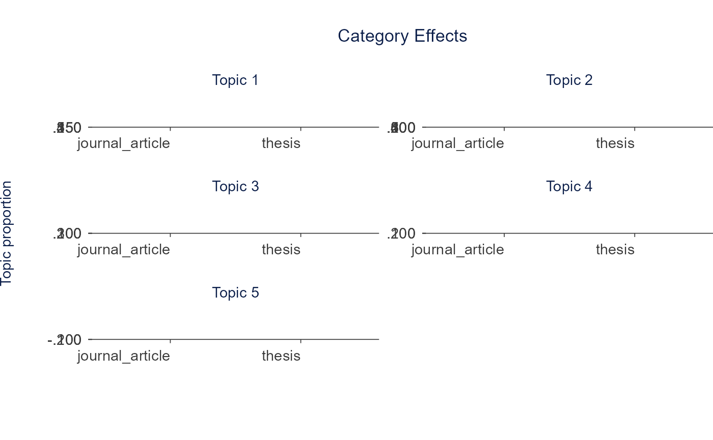
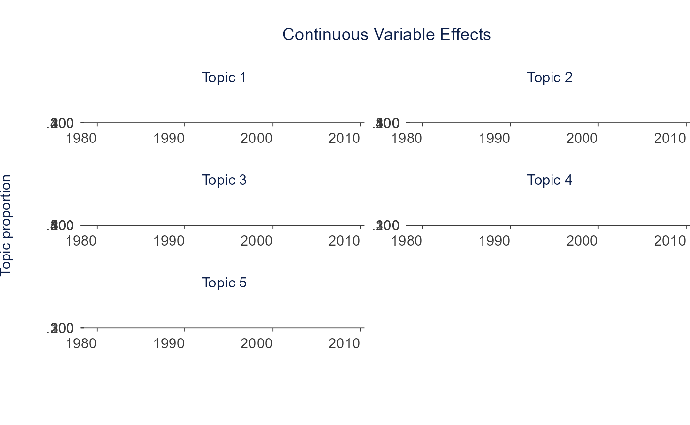

# Topic Modeling

Topic modeling discovers latent themes in a text collection. The Shiny
app offers two types:

- **Structural Topic Model (STM):** word-probability topics that
  incorporate document metadata as covariates. Runs in R.
- **Embedding-based topics:** transformer embeddings reduced and
  clustered into topics. Best for short texts and multilingual content.
  Requires Python (BERTopic) or an embedding API key.

The sections below follow the app’s **Topic Modeling** tabs in order,
first with STM (run live on the bundled data) and then with the
embedding-based type.

## Setup

A 150-document subset of `SpecialEduTech` keeps the build fast; the full
dataset works the same way.

``` r

library(TextAnalysisR)

mydata <- SpecialEduTech[1:150, ]
united_tbl <- unite_cols(mydata, listed_vars = c("title", "keyword", "abstract"))
tokens <- prep_texts(united_tbl, text_field = "united_texts", remove_stopwords = TRUE)
dfm_object <- quanteda::dfm(tokens)
```

## Model Configuration

[`find_optimal_k()`](https://mshin77.github.io/TextAnalysisR/reference/find_optimal_k.md)
compares models across a range of K via `searchK` (semantic coherence,
exclusivity, held-out likelihood, residuals). The example uses a small
document subset and a narrow K range to keep the runtime short.

``` r

k_search <- find_optimal_k(dfm_object, topic_range = 5:6)
```

    ## Beginning Spectral Initialization 
    ##   Calculating the gram matrix...
    ##   Finding anchor words...
    ##      .....
    ##   Recovering initialization...
    ##      ........................
    ## Initialization complete.
    ## ......................................................................................................................................................
    ## Completed E-Step (0 seconds). 
    ## Completed M-Step. 
    ## Completing Iteration 1 (approx. per word bound = -6.406) 
    ## ......................................................................................................................................................
    ## Completed E-Step (0 seconds). 
    ## Completed M-Step. 
    ## Completing Iteration 2 (approx. per word bound = -6.091, relative change = 4.914e-02) 
    ## ......................................................................................................................................................
    ## Completed E-Step (0 seconds). 
    ## Completed M-Step. 
    ## Completing Iteration 3 (approx. per word bound = -6.049, relative change = 6.977e-03) 
    ## ......................................................................................................................................................
    ## Completed E-Step (0 seconds). 
    ## Completed M-Step. 
    ## Completing Iteration 4 (approx. per word bound = -6.041, relative change = 1.231e-03) 
    ## ......................................................................................................................................................
    ## Completed E-Step (0 seconds). 
    ## Completed M-Step. 
    ## Completing Iteration 5 (approx. per word bound = -6.038, relative change = 5.302e-04) 
    ## Topic 1: learning, students, instruction, computer, assisted 
    ##  Topic 2: technology, education, disabilities, mathematics, computer 
    ##  Topic 3: students, mathematics, disabilities, education, computer 
    ##  Topic 4: students, learning, computer, instruction, mathematics 
    ##  Topic 5: students, education, learning, mathematics, computer 
    ## ......................................................................................................................................................
    ## Completed E-Step (0 seconds). 
    ## Completed M-Step. 
    ## Completing Iteration 6 (approx. per word bound = -6.036, relative change = 3.099e-04) 
    ## ......................................................................................................................................................
    ## Completed E-Step (0 seconds). 
    ## Completed M-Step. 
    ## Completing Iteration 7 (approx. per word bound = -6.035, relative change = 1.666e-04) 
    ## ......................................................................................................................................................
    ## Completed E-Step (0 seconds). 
    ## Completed M-Step. 
    ## Completing Iteration 8 (approx. per word bound = -6.035, relative change = 1.020e-04) 
    ## ......................................................................................................................................................
    ## Completed E-Step (0 seconds). 
    ## Completed M-Step. 
    ## Model Converged 
    ## Beginning Spectral Initialization 
    ##   Calculating the gram matrix...
    ##   Finding anchor words...
    ##      ......
    ##   Recovering initialization...
    ##      ........................
    ## Initialization complete.
    ## ......................................................................................................................................................
    ## Completed E-Step (0 seconds). 
    ## Completed M-Step. 
    ## Completing Iteration 1 (approx. per word bound = -6.376) 
    ## ......................................................................................................................................................
    ## Completed E-Step (0 seconds). 
    ## Completed M-Step. 
    ## Completing Iteration 2 (approx. per word bound = -5.997, relative change = 5.939e-02) 
    ## ......................................................................................................................................................
    ## Completed E-Step (0 seconds). 
    ## Completed M-Step. 
    ## Completing Iteration 3 (approx. per word bound = -5.964, relative change = 5.427e-03) 
    ## ......................................................................................................................................................
    ## Completed E-Step (0 seconds). 
    ## Completed M-Step. 
    ## Completing Iteration 4 (approx. per word bound = -5.957, relative change = 1.257e-03) 
    ## ......................................................................................................................................................
    ## Completed E-Step (0 seconds). 
    ## Completed M-Step. 
    ## Completing Iteration 5 (approx. per word bound = -5.955, relative change = 3.371e-04) 
    ## Topic 1: learning, students, instruction, disabilities, computer 
    ##  Topic 2: technology, education, disabilities, mathematics, students 
    ##  Topic 3: students, mathematics, disabilities, education, learning 
    ##  Topic 4: computer, instruction, learning, assisted, students 
    ##  Topic 5: students, learning, mathematics, education, computer 
    ##  Topic 6: computer, software, learning, education, students 
    ## ......................................................................................................................................................
    ## Completed E-Step (0 seconds). 
    ## Completed M-Step. 
    ## Completing Iteration 6 (approx. per word bound = -5.954, relative change = 1.616e-04) 
    ## ......................................................................................................................................................
    ## Completed E-Step (0 seconds). 
    ## Completed M-Step. 
    ## Completing Iteration 7 (approx. per word bound = -5.953, relative change = 1.310e-04) 
    ## ......................................................................................................................................................
    ## Completed E-Step (0 seconds). 
    ## Completed M-Step. 
    ## Model Converged

``` r

names(k_search)
```

    ## [1] "results"  "call"     "settings"

Fit a small STM for the examples below. `prevalence` makes topic
proportions depend on document metadata.

``` r

out <- quanteda::convert(dfm_object, to = "stm")
out$meta$year <- as.numeric(out$meta$year)

model <- stm::stm(
  documents = out$documents,
  vocab = out$vocab,
  K = 5,
  prevalence = ~ reference_type + year,
  data = out$meta,
  max.em.its = 15,
  init.type = "Spectral",
  verbose = FALSE
)
```

See: [Structural Topic Model](https://www.structuraltopicmodel.com/) ·
[stm on CRAN](https://CRAN.R-project.org/package=stm)

## Word-Topic

[`get_topic_terms()`](https://mshin77.github.io/TextAnalysisR/reference/get_topic_terms.md)
returns the top terms per topic from the word-topic (beta) distribution.

``` r

terms <- get_topic_terms(model, top_term_n = 10)
head(terms, 15)
```

    ## # A tibble: 15 × 3
    ##    topic term           beta
    ##    <int> <chr>         <dbl>
    ##  1     1 students     0.0497
    ##  2     1 learning     0.0386
    ##  3     1 instruction  0.0335
    ##  4     1 disabilities 0.0272
    ##  5     1 mathematics  0.0221
    ##  6     1 computer     0.0180
    ##  7     1 math         0.0165
    ##  8     1 education    0.0151
    ##  9     1 assisted     0.0146
    ## 10     1 disabled     0.0114
    ## 11     2 computer     0.0290
    ## 12     2 learning     0.0248
    ## 13     2 instruction  0.0244
    ## 14     2 assisted     0.0239
    ## 15     2 students     0.0204

## Content Generation

[`generate_topic_content()`](https://mshin77.github.io/TextAnalysisR/reference/generate_topic_content.md)
drafts topic-grounded content (survey items, research questions, theme
descriptions, policy recommendations, interview questions) from
[`get_topic_terms()`](https://mshin77.github.io/TextAnalysisR/reference/get_topic_terms.md)
output. It calls an LLM, so it needs an OpenAI or Gemini API key.

| Content type            | Output                    |
|-------------------------|---------------------------|
| `survey_item`           | Likert-scale statement    |
| `research_question`     | Research question         |
| `theme_description`     | Qualitative theme summary |
| `policy_recommendation` | Action-oriented statement |
| `interview_question`    | Open-ended question       |

``` r

labels <- generate_topic_labels(terms, provider = "openai")

content <- generate_topic_content(terms, content_type = "research_question", provider = "openai")
```

## Document-Topic

[`calculate_topic_probability()`](https://mshin77.github.io/TextAnalysisR/reference/calculate_topic_probability.md)
summarizes the corpus-level expected topic proportions (mean of the
per-document theta matrix).

``` r

doc_topic <- calculate_topic_probability(model, top_n = 10, verbose = FALSE)
doc_topic
```

    ## # A tibble: 5 × 2
    ##   topic gamma
    ##   <int> <dbl>
    ## 1     1 0.265
    ## 2     2 0.223
    ## 3     3 0.215
    ## 4     4 0.157
    ## 5     5 0.141

## Quotes

[`stm::findThoughts()`](https://rdrr.io/pkg/stm/man/findThoughts.html)
returns the documents most representative of a topic.

``` r

quotes <- stm::findThoughts(model, texts = united_tbl$united_texts, topics = 1, n = 3)
quotes
```

    ## 
    ##  Topic 1: 
    ##       A study to determine the effectiveness of computer-assisted instruction on the mathematics achievement levels of learning disabled elementary students computer-assisted instruction.//mathematics achievement.//learning disabled elementary students.//Computer Assisted Instruction.//Elementary School Students.//Learning Disabilities.//Special Education.//Mathematics.//Teaching Students experiencing difficulties in mathematics are present in most classrooms. There are in excess of 6 million students who receive special education services in the United States (U.S. Department of Education, 2001), and between 5% and 10% of school children experience some type of mathematical learning disability (Geary, 2004; Kroesbergen & Luit, 2003). In addition to problems with conceptualization, speed of processing, and effective use of strategies, one of the deficiencies that can negatively affect the performance of these students is fact retrieval. Research indicates that the ability to succeed in higher level math skills is directly related to the student's ability to effectively use lower level mathematics skills such as basic facts (Hasselbring, 1987; Hasselbring, Lott, & Zydney, 2006; Mattingly & Bott, 1990). The purpose of this research was to study the effects of Computer-Assisted Instruction on Learning Disabled students' performance in mathematics. Specifically, this study investigated whether using computer-assisted instruction could significantly affect the students' achievement levels on the Measures of Academic Progress test. The population consisted of 190 students enrolled in an elementary school in the Low Country of South Carolina. The participants were divided into two groups: (1) 165 students in grades 3 through 5 regular classes who did not receive computer-assisted instruction and (2) 25 students in grades 3 through 5 placed in the Learning Disabilities Resource Program who did receive computer-assisted instruction. All students were pre-tested on the Measures of Academic Progress. The experimental group received instruction on the FACTMASTER® CD-ROM program. The Measure of Academic Progress test was utilized to measure pre-treatment and post-treatment achievement levels. The following research questions were addressed: (1) Do significant differences exist between the pre-test and post-test scores for those Learning Disabled students receiving computer-assisted instruction and those students in the regular education class who do not receive computer-assisted instruction at the third, fourth, and fifth grade level? (2) Do significant differences exist between the pre-test and post-test scores for those Learning Disabled students receiving computer-assisted instruction and those students in the regular education class who do not receive computer-assisted instruction at the third grade level? (3) Do significant differences exist between the pre-test and post-test scores for those Learning Disabled students receiving computer-assisted instruction and those students in the regular education class who do not receive computer-assisted instruction at the fourth grade level? (4) Do significant differences exist between the pre-test and post-test scores for those Learning Disabled students receiving computer-assisted instruction and those students in the regular education class who do not receive computer-assisted instruction at the fifth grade level? The primary instrument was the Measured Academic Performance Test. Independent samples t tests were conducted in order to compare the means of the pre-test to post-test gains of the groups involved.
    ##      Blending Assessment with Instruction Program (BAIP): Impact of an online standards-based curriculum on 8th grade students' math achievement Blending Assessment with Instruction Program.//online standards.//curriculum.//8th grade students'.//math achievement.//Grade Level.//Internet.//Mathematics Achievement.//Programmed Instruction.//Mathematics Education.//Schools.//Students The primary purpose of this study was to pilot test the Blending Assessment with Instruction Program, a standards-based mathematics intervention in an inclusive setting, with eighth grade students. The Blending Assessment with Instruction Program intervention incorporated web-based lessons for teachers, online tutorials for students, and classroom management system into standards-based mathematics instruction. The focus was to determine the effectiveness of the design, content and usability as measured by teacher perceptions and outcome data of participating students. Student outcomes were measured by performance on pretests and posttests and statewide mathematics assessments. A secondary purpose was to evaluate the effectiveness of the intervention on (a) students with disabilities who receive their math instruction in the general education classroom and (b) students who qualify for free lunch. These two subgroups were identified to evaluate whether the intervention significantly impacted the population of students involved in the achievement gaps in math. The study was part of a more comprehensive pilot test of Blending Assessment with Instruction Program in grades 4, 5, 6, 7, and 8. A total of 222 eighth-grade students from the three schools in Kansas participated in the pilot test. The teachers included four general education and special education classroom teachers. The study utilized a quasi-experimental comparison-group design to measure the impact of Blending Assessment with Instruction Program on eighth-grade student math achievement. Data were collected to evaluate the effectiveness of Blending Assessment with Instruction Program relative to student performance on a pre/post test, 2006-2007 state assessment, and teacher perceptions and satisfaction of the intervention. The results of the pilot study did not show a statistically significant achievement difference on the overall state math assessment score or the select indicator score between students who received the Blending Assessment with Instruction Program intervention vs. the comparison group of students who did not. However, although significant differences were not found between the intervention and the comparison groups, significant differences did exist between the posttest scores of the subgroups of students who received the Blending Assessment with Instruction Program intervention. Additionally, the tutorial data suggested a strong correlation between the Blending Assessment with Instruction Program tutorials and select indicators.
    ##      A comparison of two empirically validated approaches to teaching ratios and proportions to secondary remedial and learning disabled students videodisc program vs active teaching paradigm.//mathematics achievement.//remedial & learning disabled high school students.//Learning Disabilities.//Mathematics Education.//Remedial Education.//Special Education.//Teaching Methods.//High School Students This study compared two curricula designed to teach ratio and proportion word problems. The experimental curriculum incorporated instructional design variables which have been shown to be most effective in teaching students; e.g., teaching discreet strategies in small steps. This curriculum was presented via an interactive videodisc program. The comparison curriculum was derived from four math basals and was taught following an active teaching paradigm. The curricula were matched for content and length. The subjects included 29 secondary students who qualified for remedial or special education services in math. The subjects were matched based on scores from a preskills test and the math portion of the Metropolitan Achievement Test and then randomly assigned to one of the two treatments. There were 16 students in the basal group and 13 students in the videodisc group. During the intervention data was collected on the groups' on-task behavior, levels of appropriate teacher implementation, and written work. At the end of the six-week intervention students were administered a 21-item posttest. Teachers and students completed questionnaires regarding their perceptions of the two curricula. A parallel form of the posttest was administered as a maintenance test ten school days after the completion of the study. The students in the videodisc group performed significantly higher on the posttest and insignificantly higher on the maintenance test than students in the basal group. Means for the videodisc group on work samples were consistently above 80%, while means for the basal group showed a downward trend with means falling from 90% to 72%. Descriptive measures showed the percentage of on-task behavior for the videodisc and basal groups to be 76% and 68% respectively, with percentages of off-task behavior 10% and 20% respectively. Appropriate levels of teacher implementation were found for both groups. While the teachers felt strongly that the videodisc program was instructionally superior, they missed the greater interactions with students the basal curriculum afforded them. On the student questionnaire, a greater percentage of students in the videodisc group than in the basal group indicated they now felt able to successfully work proportion word problems.

## Estimated Effects

[`stm::estimateEffect()`](https://rdrr.io/pkg/stm/man/estimateEffect.html)
regresses topic proportions on document covariates;
[`tidytext::tidy()`](https://generics.r-lib.org/reference/tidy.html)
returns the per-topic coefficient table shown in the app’s Estimated
Effects tab.

``` r

prep <- stm::estimateEffect(1:5 ~ reference_type + year, model, metadata = out$meta, uncertainty = "Global")
head(tidytext::tidy(prep), 10)
```

    ## # A tibble: 10 × 6
    ##    topic term                   estimate std.error statistic p.value
    ##    <int> <chr>                     <dbl>     <dbl>     <dbl>   <dbl>
    ##  1     1 (Intercept)            0.673      8.08       0.0833 0.934  
    ##  2     1 reference_typethesis   0.140      0.0953     1.46   0.145  
    ##  3     1 year                  -0.000221   0.00405   -0.0546 0.957  
    ##  4     2 (Intercept)           21.5        7.51       2.86   0.00485
    ##  5     2 reference_typethesis   0.276      0.0874     3.16   0.00190
    ##  6     2 year                  -0.0107     0.00376   -2.84   0.00521
    ##  7     3 (Intercept)          -20.2        7.51      -2.69   0.00800
    ##  8     3 reference_typethesis  -0.186      0.0826    -2.25   0.0259 
    ##  9     3 year                   0.0102     0.00377    2.72   0.00728
    ## 10     4 (Intercept)          -11.7        6.81      -1.72   0.0867

## Categorical Covariates

[`plot_topic_effects_categorical()`](https://mshin77.github.io/TextAnalysisR/reference/plot_topic_effects_categorical.md)
plots topic proportions across the levels of a categorical covariate.
`stm::plot.estimateEffect(..., method = "pointestimate", omit.plot = TRUE)`
returns the model-based estimate and 95% CI per topic and level,
reshaped here into the columns the plot expects.

``` r

ec <- stm::plot.estimateEffect(prep, "reference_type", method = "pointestimate",
                               model = model, omit.plot = TRUE)
effects_cat <- do.call(rbind, lapply(seq_along(ec$topics), function(i) {
  data.frame(topic = ec$topics[i], value = as.character(ec$uvals),
             proportion = as.numeric(ec$means[[i]]),
             lower = as.numeric(ec$cis[[i]][1, ]), upper = as.numeric(ec$cis[[i]][2, ]))
}))
plot_topic_effects_categorical(effects_cat)
```



## Continuous Covariates

[`plot_topic_effects_continuous()`](https://mshin77.github.io/TextAnalysisR/reference/plot_topic_effects_continuous.md)
plots topic proportions across a continuous covariate. The same
`plot.estimateEffect()` call with `method = "continuous"` returns the
estimate and CI over a grid of the covariate.

``` r

en <- stm::plot.estimateEffect(prep, "year", method = "continuous",
                               model = model, omit.plot = TRUE)
effects_cont <- do.call(rbind, lapply(seq_along(en$topics), function(i) {
  data.frame(topic = en$topics[i], value = en$x,
             proportion = as.numeric(en$means[[i]]),
             lower = as.numeric(en$ci[[i]][1, ]), upper = as.numeric(en$ci[[i]][2, ]))
}))
plot_topic_effects_continuous(effects_cont)
```



## Embedding-based Topics

The second type embeds documents with a transformer, reduces
dimensionality, and clusters the embeddings into topics.
[`get_best_embeddings()`](https://mshin77.github.io/TextAnalysisR/reference/get_best_embeddings.md)
produces the embeddings and
[`fit_embedding_model()`](https://mshin77.github.io/TextAnalysisR/reference/fit_embedding_model.md)
clusters them;
[`generate_topic_labels()`](https://mshin77.github.io/TextAnalysisR/reference/generate_topic_labels.md)
drafts labels. These need Python (BERTopic) or an embedding API key, so
they are shown without running.

``` r

embeddings <- get_best_embeddings(united_tbl$united_texts, provider = "openai")

topics <- fit_embedding_model(
  united_tbl$united_texts,
  method = "umap_hdbscan",
  n_topics = 10,
  precomputed_embeddings = embeddings
)

embedding_labels <- generate_topic_labels(topics$topic_terms, provider = "openai")
```

| Provider | Model | Notes |
|----|----|----|
| Sentence Transformers (default) | all-MiniLM-L6-v2, all-mpnet-base-v2 | Requires Python |
| OpenAI | text-embedding-3-small, text-embedding-3-large | API key |
| Gemini | gemini-embedding-001 | API key |

R backend methods follow `{dimred}_{clustering}` (e.g., `"umap_dbscan"`,
`"tsne_kmeans"`, `"pca_hierarchical"`). See:
[BERTopic](https://maartengr.github.io/BERTopic/) ·
[Sentence-BERT](https://www.sbert.net/)

## STM vs Embedding

| Feature             | STM    | Embedding     |
|---------------------|--------|---------------|
| Speed               | Fast   | Medium        |
| Metadata covariates | Yes    | No            |
| Short texts         | Weaker | Strong        |
| Multilingual        | No     | Yes           |
| Dependencies        | R only | Python or API |
