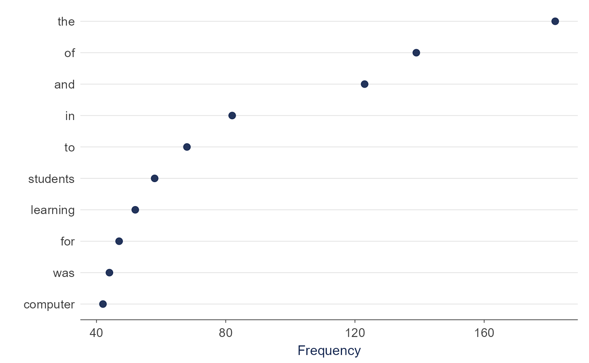

# Accessibility

``` r

library(TextAnalysisR)

mydata <- SpecialEduTech[seq_len(20), c("title", "abstract")]
united <- unite_cols(mydata, listed_vars = c("title", "abstract"))
toks   <- prep_texts(united, text_field = "united_texts")
dfm    <- quanteda::dfm(toks)
plot_word_frequency(dfm, n = 10)
```



TextAnalysisR meets WCAG 2.1 Level AA standards.

## Keyboard Navigation

| Key             | Action                |
|-----------------|-----------------------|
| Tab / Shift+Tab | Move between elements |
| Enter / Space   | Activate buttons      |
| Esc             | Close dialogs         |

## Visual Features

- Dark mode toggle
- High contrast (4.5:1 ratio)
- 200% zoom support
- Reduced motion option

## Screen Reader Support

- Descriptive button labels
- Chart text descriptions
- Status announcements

## Language Support

- 100+ languages via Google Translate
- Auto-detected text-to-speech
