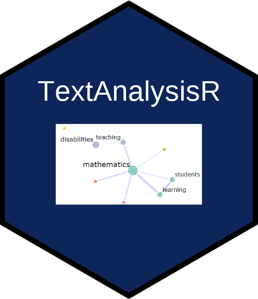

Text mining and natural language processing workflow for documents
(`PDF`, `DOCX`, `XLSX`, `CSV`, `TXT`). Includes preprocessing via
[quanteda](https://github.com/quanteda/quanteda), lexical analysis
(term frequency-inverse document frequency, log-odds ratios, lexical
diversity) via [tidytext](https://github.com/juliasilge/tidytext),
topic modeling via [stm](https://github.com/bstewart/stm) and
[BERTopic](https://maartengr.github.io/BERTopic/), semantic similarity
and document clustering on transformer embeddings, an interactive
[Shiny](https://shiny.posit.co/) interface with
[ggplot2](https://ggplot2.tidyverse.org/) visualization, optional
[spaCy](https://spacy.io/) lemmatization, and local
[sentence-transformers](https://www.sbert.net/) or web-based
(OpenAI,
[Gemini](https://ai.google.dev/)) model providers for
retrieval-augmented generation.

## Installation

    install.packages("TextAnalysisR",
      repos = c("https://mshin77.r-universe.dev", "https://cloud.r-project.org"))

## Load the TextAnalysisR Package

    library(TextAnalysisR)

## Alternatively, Launch and Browse the Shiny App

Access the web app at <https://www.textanalysisr.org>.

Launch and browse the app on the local computer:

    run_app()

## Getting Started

See [Quick
Start](https://mshin77.github.io/TextAnalysisR/articles/quickstart.html)
for tutorials.

## Citation

- Shin, M. (2026). *TextAnalysisR: A text mining workflow tool* (R
  package version 0.1.4) \[Computer software\].
  <https://mshin77.github.io/TextAnalysisR/>

- Shin, M. (2026). *TextAnalysisR: A text mining workflow tool* \[Web
  application\]. <https://www.textanalysisr.org>
